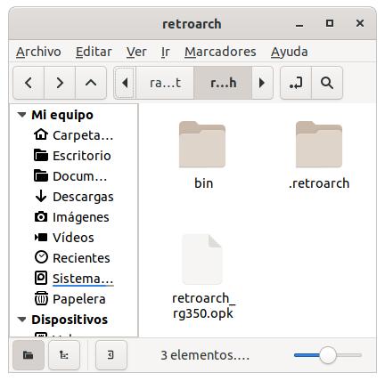

In December, official RetroArch distributions for RG350 and RG280 began to appear. At the moment they are beta version in the form of nightly builds that can be obtained from [this site](https://buildbot.libretro.com/nightly/dingux/mips32/).

The zip files that they distribute contain a single OPK and a directory (with all the configuration and cores) to be copied to the home of the console:



Once everything is in place, the only way to run the ROMs with the cores included in the distribution is through the only OPK that launches RetroArch as frontend (UX mode, like it is known in other emulators):


To achieve a more complete integration of RetroArch, respecting the normal experience of the usual frontends in RG350 / RG280 (GMenu2X, SimpleMenu, PyMenu, EmulationStation, etc.), wrapper-type OPKs can be created that allow selecting the ROMs and launching the corresponding RetroArch core, since the `retroarch` binary/executable inside the OPK supports the same arguments as RetroArch on other platforms.

## OPK wrappers

To achieve this, it was first necessary to figure out how to parameterize the core and the ROM. Loading a core and a ROM from RetroArch itself does not work because it does not externalize this data as arguments on the executable. So I assumed that the same argument format used by the `retroarch` executable would serve on other systems like EmuELEC on RG351P. In this console the usual EmulationStation frontend does parameterize the core and the ROM to be executed by means of arguments in the call. For example, running Tetris on Game Boy with the core gambatte in EmuELEC on RG3551P, the process is invoked in this way:

```
/usr/bin/retroarch -v -L /tmp/cores/gambatte_libretro.so --config /storage/.config/retroarch/retroarch.cfg /storage/roms/gb/Tetris (World) (Rev A).7z
```

Therefore, the idea is, first, to install the RetroArch executable/binary that is inside the OPK in an accessible path (`/media/data/local/bin` is chosen), and then build different OPKs that invoke a script whith the ROM to be executed as argument. Inside the script we can mount the complete call to the `retroarch`. For example for the Game Boy system the script could be the following:

```bash
#!/bin/sh
/media/data/local/bin/retroarch -v -L /media/data/local/home/.retroarch/cores/gambatte_libretro.so --config /media/data/local/home/.retroarch/retroarch.cfg "$1"
```

We put the previous script together with an appropriate icon for the system that is going to launch and a `.desktop` that invokes the script passing the ROM as an argument, for example:

```
[Desktop Entry]
Name=Nintendo GB (RA)
Comment=Nintendo GB in RetroArch
Exec=exec.sh %f
Terminal=false
Type=Application
StartupNotify=true
Icon=icon
Categories=retroarch;
X-OD-NeedsDownscaling=true
```

This are the cores offered by the latest version of RetroArch released at the time of writing (2021-04-15).

* fbalpha2012_cps1_libretro: CPS1
* fbalpha2012_cps2_libretro: CPS2
* fbalpha2012_neogeo_libretro: Neo Geo
* fceumm_libretro: NES
* gambatte_libretro: GB/GBC
* genesis_plus_gx_libretro and genesis_plus_gx_wide_libretro: MD, MS, GG, SEGA CD
* gpsp_libretro: GBA
* handy_libretro: LYNX
* mednafen_pce_fast_libretro: PCE, PCE CD
* mednafen_wswan_libretro: WS
* mgba_libretro: GBA
* mrboom_libretro: MrBoom
* picodrive_libretro: MD, MS, SEGA CD, SEGA 32X
* pokemini_libretro: POKEMINI
* prboom_libretro: DOOM
* quicknes_libretro: NES
* race_libretro: NGP
* snes9x2005_libretro: SNES
* snes9x2005_plus_libretro: SNES
* tyrquake_libretro: QUAKE
* vice_x64_libretro: C64
* stella2014_libretro: Atari 2600
* prosystem_libretro: Atari 7800
* scummvm_libretro: ScummVM
* tic80_libretro: TIC-80
* potator_libretro: Watara Supervision
* dosbox_pure_libretro: DOSBox
* o2em_libretro: Magnavox Odyssey2, Phillips Videopac+
* mame2003_libretro, mame2003_plus_libretro: MAME2003

Therefore, we have to make one OPK at least for each of them. We say *at least* because the option of making an OPK for each "core/system to emulate" combination can be considered.

**Warning**: Remember that following cores need BIOS files to run: LYNX, PC ENGINE CD, SEGA CD, VIDEOPAC.

## Installer

As there are several pieces necessary for the set to work, an installer has been created to install everything you need in one go. Specifically, the installer integrates this items:

* 37 OPKs to launch the different core/system combinations independently from different frontends (GMenu2X, SimpleMenu, PyMenu, EmulationStation, etc.) by previously selecting the ROM (Explorer mode).
* Binary `retroarch` in common location (`/media/data/local/bin`) to be invoked by former OPKs to not be cloned inside them.
* Configurations for all the cores differentiated by screen, that is, adequate configurations for 320x240 or 640x480 are installed depending on the screen detected. The settings have been adopted from the Retro Game Corps recommendations in [this guide](https://retrogamecorps.com/2020/12/24/guide-retroarch-on-rg350-and-rg280-devices/).
* GMenu2X filters by extension for each system (including `7z` in all systems and `chd` in CD systems).
* New section with the RetroArch icon in all the skins installed in GMenu2X where all the OPK launchers appear.

The OPK with the installer can be obtained in the releases of [this repository](https://github.com/eduardofilo/RG350_ra_installer/releases/latest).

## Hoykeys

In RetroArch configuration file the following hotkeys have been defined.

|Function|Shortcut|
|:-------|:-------|
|Pause|`Select + A`|
|Reset|`Select + B`|
|RetroArch Menu|`Select + X`|
|Fast forward|`Select + Y`|
|Savestate save|`Select + R1`|
|Savestate load|`Select + L1`|
|Swap disk|`Select + R2`|
|Open CD tray|`Select + L2`|
|Close content|`Select + Start`|
|Savestate slot changing|`Select + ←→`|
|Volume changing|`Select + ↑↓`|
